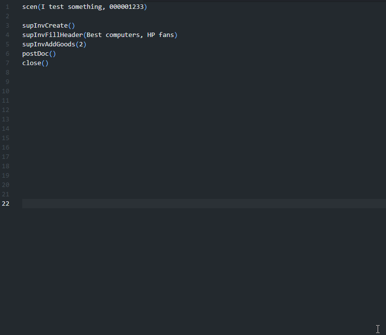

# Vanessa Shortcuts
Write clear and easy-to-maintain tests in 1C:Drive!
## Features

### Use predefined commands to write tests in 1C:Drive. 

For example:
Start typing `supInv` and you will see all existing actions in the Supplier invoice document. <br />Then press `Tab` button to complete string:


<br />
<br />

### Combine commands and use parameters
You can use `>` or `;` between shortcuts or write them on separate lines. 
<br />You can specify parameters in the shortcut.

#### For example:<br />
```
supInvCreate() > supInvFillHeader(Best computers, HP fans) > supInvAddGoods(2) > postDoc() ; close()
```
<br />
<br />Or<br /><br />

````
supInvCreate()
supInvFillHeader(Best computers, HP fans) > supInvAddGoods(2)
postDoc()
close()
````
<br />
<br />


### Use shortcuts to create complex scenario
Just press the `Tab` button on the selected line(-s):



<br />
<br />

## Extension Settings

In `Settings > Extensions > Vanessa Shortcuts` you should specify paths to the snippets files.

1. Autocomplete Path - a file with shortcuts to provide autocomplete suggestions
2. Snippets Path - a file with code snippets to replace shortcuts with actual scenarios
